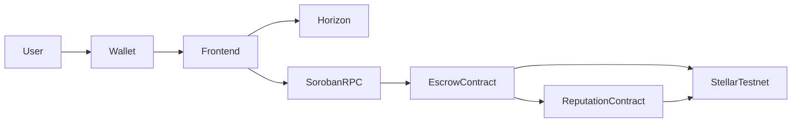

# StellarPay


### Decentralized Escrow Platform Built on Stellar & Soroban

🎥 **Demo Video**

https://drive.google.com/file/d/1XdiRBa6sInlLqmFSyftHdSAv9h8t1sje/view

🌐 **Live Demo**

[StellarPay](https://stellarpay21.netlify.app/)

---

# Overview

StellarPay is a decentralized escrow platform built on the Stellar Testnet using Soroban Smart Contracts.

The platform enables users to securely lock XLM into escrow agreements, release or refund funds, manage disputes, and maintain an on-chain reputation score. It also provides analytics, transaction tracking, live activity updates, and multi-wallet support through a frontend-first architecture.

---

# Features

- Multi-Wallet Support (Freighter, Albedo, xBull)
- Wallet Connect / Disconnect
- XLM Balance Display
- Escrow Creation
- Release & Refund Workflow
- Dispute Resolution
- Reputation Dashboard
- Trust Leaderboard
- Analytics Dashboard
- Event Feed
- Transaction Lifecycle Tracking
- Mobile Responsive UI
- Soroban Smart Contract Integration
- GitHub Actions CI/CD
- Frontend & Smart Contract Tests

---

# Tech Stack

## Frontend

- React
- Vite
- Tailwind CSS
- TypeScript

## Blockchain

- Stellar SDK
- Soroban SDK
- Horizon API
- Soroban RPC

## Wallets

- Freighter
- Albedo
- xBull

## Deployment

- Netlify

## CI/CD

- GitHub Actions

---

# Architecture



---

# User Flow

```text
Connect Wallet
        ↓
Create Escrow
        ↓
Lock XLM
        ↓
Release / Refund
        ↓
Reputation Updated
        ↓
Transaction Completed
```

---

# Screenshots

## Dashboard


---

## Wallet Integration


---

## Reputation Dashboard


---

## Escrow Manager


---

## Activity Feed


---

## Analytics Dashboard


---

## Mobile Responsive UI


---

## CI/CD Pipeline


---

# Smart Contracts

## Contract Deployment Proof

### Escrow Contract

* Contract ID: `CDMLNC5EUTGZDAPOJSKGYGGOVPOSUFMRUXIWUB4C3ERJZIQSMXMDDI6N`
* Stellar Expert Testnet Link: [CDMLNC5EUTGZDAPOJSKGYGGOVPOSUFMRUXIWUB4C3ERJZIQSMXMDDI6N](https://stellar.expert/explorer/testnet/contract/CDMLNC5EUTGZDAPOJSKGYGGOVPOSUFMRUXIWUB4C3ERJZIQSMXMDDI6N)

### Reputation Contract

* Contract ID: `CDWJQYLPI6SBNGTUGAN4V3SA7GEE6LZIOMMU46CQPM4NHDTSGGU47HQO`
* Stellar Expert Testnet Link: [CDWJQYLPI6SBNGTUGAN4V3SA7GEE6LZIOMMU46CQPM4NHDTSGGU47HQO](https://stellar.expert/explorer/testnet/contract/CDWJQYLPI6SBNGTUGAN4V3SA7GEE6LZIOMMU46CQPM4NHDTSGGU47HQO)

### Transaction Verification

* Transaction Hash: `be4425c1c8cd263d23495054c3105de3484b23b9c2a593b7948a8937928c2aee`
* Stellar Expert Testnet Transaction Link: [be4425c1c8cd263d23495054c3105de3484b23b9c2a593b7948a8937928c2aee](https://stellar.expert/explorer/testnet/tx/be4425c1c8cd263d23495054c3105de3484b23b9c2a593b7948a8937928c2aee)

---

# Project Structure

```bash
src/
├── components/
├── hooks/
├── pages/
├── services/
├── contexts/
├── utils/

contracts/
├── escrow/
└── reputation/

tests/

.github/
└── workflows/
```

---

# Local Setup

```bash
git clone https://github.com/aruu-27/StellarPay.git

cd StellarPay

npm install

npm run dev
```

---

# Build

```bash
npm run build
```

---

# Run Tests

Frontend

```bash
npm test
```

Contracts

```bash
cargo test
```

---

# Deployment

```bash
npm run build
```

Deploy the generated `dist/` folder to **Netlify**.

---

# CI/CD

GitHub Actions automatically performs:

- Install Dependencies
- Build Application
- Frontend Tests
- Smart Contract Tests

---

# Stellar Level 3 Checklist


- Wallet Connection
- Multi-Wallet Support
- Balance Fetching
- Smart Contract Deployment
- Frontend Contract Calls
- Event Streaming
- Transaction Tracking
- Error Handling
- Loading States
- Mobile Responsive UI
- Frontend Tests
- Smart Contract Tests
- GitHub Actions CI/CD
- Documentation
- Live Demo
- Demo Video

---

# License

MIT License
